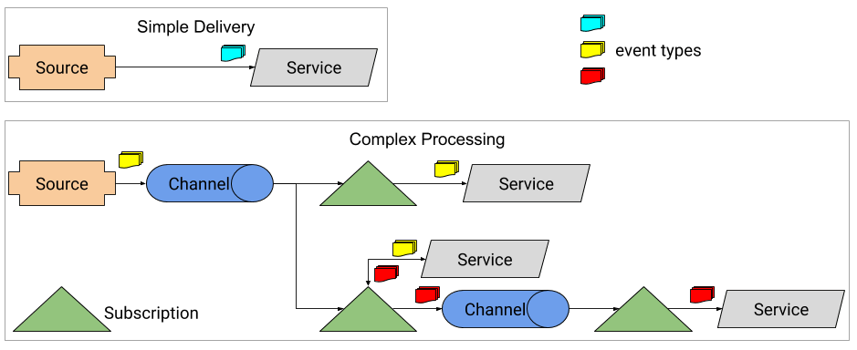

# Knative-tutorial


This tutorial shows how to create a GKE cluster with Knative installed.
We also run a Kafka cluster inside the Kubernetes cluster, to demonstrate
Kafka as an event source for a Knative service.

## Create a GKE cluster
```shell
./setup-cluster.sh
gcloud container clusters list
```

# Get Kubernetes credentials
`gcloud container clusters get-credentials <cluster-name> --zone us-central1-c`

## Grant cluster administrator (admin) permissions to the current user. 
## To create the necessary RBAC rules for Istio, the current user requires admin permissions.
```shell
kubectl create clusterrolebinding cluster-admin-binding \
    --clusterrole=cluster-admin \
    --user=$(gcloud config get-value core/account)
```

## Install Istio (version 1.8.2 or higher, without sidecar injection is recommended)
### Download Istio and setup istioctl
```shell
curl -L https://istio.io/downloadIstio | sh -
export PATH=$PWD/istio-1.10.1/bin:$PATH

istioctl install -f istio-minimal-operator.yaml
```

### Verify Istio installation
`kubectl get pods --namespace istio-system`

### Uninstall Istio
### istioctl x uninstall --purge

## Install Knative Operator
`kubectl apply -f https://github.com/knative/operator/releases/download/v0.23.0/operator.yaml`

### Verify installation
`kubectl get deployment knative-operator`

## Setup Knative Serving
`kubectl apply -f knative-serving.yaml`

### Verify serving installation
```shell
kubectl get deployment -n knative-serving
kubectl get namespace knative-serving -o 'go-template={{index .metadata.labels "serving.knative.dev/release"}}'
```

## Install DNS hack for testing
`kubectl apply --filename https://github.com/knative/serving/releases/download/v0.23.0/serving-default-domain.yaml`

### Verify DNS domain
`kubectl get cm config-domain --namespace knative-serving -o jsonpath='{.data}' | grep sslip.io`

## Install Knative Eventing
`kubectl apply -f knative-eventing.yaml`

### Verify Eventing
```shell
kubectl get deployment -n knative-eventing
kubectl get KnativeEventing knative-eventing -n knative-eventing
kubectl get namespace knative-eventing -o 'go-template={{index .metadata.labels "eventing.knative.dev/release"}}'
```

# Test Knative Serving
`kubectl apply --filename service.yaml`

## Verify Serving
`kubectl get ksvc helloworld-go  --output=custom-columns=NAME:.metadata.name,URL:.status.url`
### Use curl or a web browser to test URL

### Notice after 60 seconds with no traffic, the deployment will scale down to zero
`watch kubectl get pods`

## Clean up service
`kubectl delete --filename service.yaml`

# Kafka installation
`kubectl create namespace kafka`

## Install Kafka Operator
`kubectl create -f 'https://strimzi.io/install/latest?namespace=kafka' -n kafka`

## Deploy a small, non-production, cluster of Apache Kafka (3 ephemeral zookeeper).
`kubectl apply -n kafka -f kafka-cluster.yaml`

### Verify Kafka cluster
```shell
kubectl get pods -n kafka
kubectl get crd | grep strimzi
kubectl get kafka -n kafka
kubectl get svc -n kafka
```

## Send and receive messages
```shell
kubectl -n kafka run kafka-producer -ti --image=quay.io/strimzi/kafka:0.23.0-kafka-2.8.0 \
--rm=true --restart=Never -- bin/kafka-console-producer.sh \
--broker-list my-cluster-kafka-bootstrap:9092 \
--topic my-topic
```

### In another terminal...
```shell
kubectl -n kafka run kafka-consumer -ti --image=quay.io/strimzi/kafka:0.23.0-kafka-2.8.0 \
--rm=true --restart=Never -- bin/kafka-console-consumer.sh \
--bootstrap-server my-cluster-kafka-bootstrap:9092 \
--topic my-topic --from-beginning
```

## Create a new topic
```shell
kubectl apply -f kafka-topic.yaml
kubectl get kafkatopics -n kafka
### kubectl -n kafka get kafkatopics.kafka.strimzi.io
```

## Deploy the Event Display Service
`kubectl apply --filename event-display.yaml`

### Ensure that the Service pod is running. The pod name will be prefixed with event-display
```shell
kubectl get pods
kubectl get ksvc
```

# Install the Kafka Source component inside Knative
## Install the Kakfa controller manager
`kubectl apply -f https://storage.googleapis.com/knative-nightly/eventing-kafka/latest/source.yaml`

### Verify the controller and sink are running
```shell
kubectl get deployments.apps -n knative-eventing
kubectl api-resources --api-group='sources.knative.dev'
```

## Glue Knative and Kafka together
`kubectl apply -f knative-kafka-source.yaml`

### Ensure the Apache Kafka Event Source started with the necessary configuration
```shell
kubectl get pods
kubectl logs --selector='eventing.knative.dev/sourceName=kafka-source'
```

## Test
```shell
kubectl -n kafka run kafka-producer -ti --image=quay.io/strimzi/kafka:0.23.0-kafka-2.8.0 \
--rm=true --restart=Never -- bin/kafka-console-producer.sh \
--broker-list my-cluster-kafka-bootstrap:9092 \
--topic knative-demo-topic 
```

### Verify
`kubectl logs --selector='serving.knative.dev/service=event-display' -c user-container`

## Expected Logs
☁️  cloudevents.Event
Context Attributes,
  specversion: 1.0
  type: dev.knative.kafka.event
  source: /apis/v1/namespaces/default/kafkasources/kafka-source#knative-demo-topic
  subject: partition:0#3
  id: partition:0/offset:3
  time: 2021-06-22T00:43:28.793Z
Data,
  Four

# Teardown Steps
## Remove Apache Kafka Event Source
`kubectl delete -f knative-kafka-source.yaml`

## Remove the Event Display target
`kubectl delete --filename event-display.yaml`

## Remove the Apache Kafka Event Controller
`kubectl delete -f https://storage.googleapis.com/knative-nightly/eventing-kafka/latest/source.yaml`

## Remove the Kafka Topic
`kubectl delete -f kafka-topic.yaml`

---

## Next steps:
1. Use Anthos Service Mesh (ASM), instead of vanilla Istio
2. Connect to an external Kafka cluster, instead of native K8 one
3. Use Kafka broker instead of sink

---

# References:
- https://knative.dev/docs/eventing/samples/kafka/source/
- https://github.com/meteatamel/knative-tutorial
- https://github.com/redhat-developer-demos/knative-tutorial
- https://redhat-developer-demos.github.io/knative-tutorial/knative-tutorial/advanced/eventing-with-kafka.html
- https://github.com/cloudacademy/knative-demo
- https://strimzi.io/
- https://strimzi.io/blog/2019/09/26/knative/
- https://github.com/knative-sandbox/eventing-kafka
